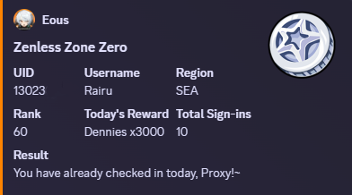
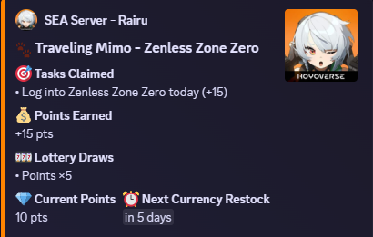
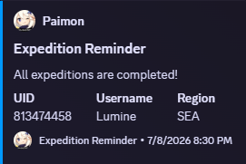

<h1 align="center">
    <br>
    HoyoLab Auto
</h1>

<p align="center">
   
   
   
</p>

# HoyoLab Auto

> **A personal improvement fork of [torikushiii/hoyolab-auto](https://github.com/torikushiii/hoyolab-auto).**
> This fork reworks the original into a **database-backed, command-managed,
> multi-guild** HoYoLAB bot: there is no static `config.json5` — accounts and
> per-server settings live in an embedded database and are managed entirely
> through Discord slash commands. It's maintained for my own use; issues and PRs
> are welcome, but expect it to track what I personally need. All credit for the
> original tool and its game integrations goes to [torikushiii](https://github.com/torikushiii).

A multi-purpose bot for the supported HoYoverse games. It handles daily
check-ins, stamina/expedition/realm reminders, automatic code redemption, and
more — one **profile** per HoYoLAB cookie, many games per profile, configured per
Discord server.

<table>
  <tr>
    <td></td>
    <td></td>
    <td></td>
  </tr>
</table>

## Table of Contents

- [HoyoLab Auto](#hoyolab-auto)
    - [Table of Contents](#table-of-contents)
    - [Google App Script](#google-app-script)
    - [Supported Games](#supported-games)
    - [Features](#features)
    - [Prerequisites](#prerequisites)
    - [Installation](#installation)
        - [Cache File Location](#cache-file-location)
    - [Migration](#migration)
    - [Usage](#usage)
    - [Notifications Setup](#notifications-setup)
    - [Contributing](#contributing)
    - [Credits](#credits)

## Google App Script

If you don't have a server to run this bot and simply want daily check-ins, you can use the standalone Google Apps Script helper.

- [Google Apps Script helper](services/google-script/README.md)

## Supported Games

- [x] Honkai Impact 3rd (Daily Check-In only)
- [x] Tears of Themis (Daily Check-In only)
- [x] Genshin Impact
- [x] Honkai: Star Rail
- [x] Zenless Zone Zero

## Features

- **Honkai Impact 3rd**:
    - **Daily check-in**: Runs every midnight local time.

- **Tears of Themis**:
    - **Daily check-in**: Runs every midnight local time.

- **Genshin Impact**:
    - **Daily check-in**: Runs every midnight local time.
    - **Dailies**: Reminds you to do your dailies, such as commissions if you haven't done them at 09:00 (local time).
    - **Weeklies**: Reminds you to do your weekly bosses/discounted resin if you haven't done them at 09:00 (local time).
    - **Stamina check**: Reminds you to spend your resin if you're at your set threshold or capped.
    - **Expedition check**: Check your expeditions and sends a notification if they're done.
    - **Realm currency**: Sends a notification if your realm currency is capped.
    - **Code Redeems**: Search for codes and redeem them automatically.
    - **Traveler's Diary**: Check your monthly currency income.
- **Honkai: Star Rail**:
    - **Daily check-in**: Runs every midnight local time.
    - **Dailies**: Reminds you to do your dailies, such as commissions if you haven't done them at 09:00 (local time).
    - **Stamina check**: Reminds you to spend your stamina if you're at your set threshold or capped.
    - **Expedition check**: Check your expeditions and sends a notification if they're done.
    - **Code Redeems**: Search for codes and redeem them automatically.
    - **Trailblazer Monthly Calendar**: Check your monthly currency income.
    - **Traveling Mimo**: Automatically complete Mimo tasks, claim points, and exchange for Stellar Jade.
- **Zenless Zone Zero**:
    - **Daily check-in**: Runs every midnight local time.
    - **Dailies**: Reminds you to do your dailies, such as commissions if you haven't done them at 09:00 (local time).
    - **Stamina check**: Reminds you to spend your stamina if you're at your set threshold or capped.
    - **Howl Scracth Card**: Notifies you if you haven't scratched the card for the day at 09:00 (local time).
    - **Shop Status**: Notifies you if the shop has finished selling videos.
    - **Code Redeems**: Search for codes and redeem them automatically.
    - **Traveling Mimo**: Automatically complete Mimo tasks, claim points, and exchange for Polychrome.

## Prerequisites

- [Docker](https://www.docker.com/) and Docker Compose (the recommended way to run the bot).
- A Discord bot application ([create one here](https://discord.com/developers/applications)), invited to your server with the `bot` and `applications.commands` scopes.
- [Git](https://git-scm.com/downloads) and [Node.js ≥ 24](https://nodejs.org/en/) — only if you want to run from source instead of Docker.

## Installation

The recommended way to run the bot is with **Docker Compose**, using the prebuilt
image from GHCR — no Node.js or build step required.

1. Grab [`docker-compose.yml`](docker-compose.yml) and [`.env.example`](.env.example)
   (clone the repo, or just download those two files into an empty directory).
2. Copy `.env.example` to `.env` and set `DISCORD_TOKEN` to your bot's token (and
   `PUID`/`PGID` to your host user so files under `./data` are owned correctly):
    ```bash
    cp .env.example .env
    ```
3. Start the container — this pulls `ghcr.io/rairulyle/hoyolab-auto:latest`:
    ```bash
    docker compose up -d
    ```
4. Finish setup with slash commands in your Discord server:
    - `/link add cookie:<your HoYoLAB cookie>` — link an account (see [Usage](#usage) below for how to grab your cookie).
    - `/config channel` — set the notification channel(s).
    - `/config timezone` — set your guild's timezone.
    - `/config schedule` — set check-in/redeem schedule times.
    - Coming from an old `config.json5`? Run `/migrate file:<config.json5>` to import your existing accounts instead of relinking them by hand.

Common management commands:

```bash
docker compose logs -f instance             # follow logs
docker compose pull && docker compose up -d # update to the latest image
docker compose down                         # stop and remove the container
```

> [!NOTE]
> The bot's entire state (profiles, guild settings, history, cache) lives in the
> `./data` bind mount, so it survives restarts and image updates.
> First time using Docker on this host? You may need to:
>
> - Add your user to the `docker` group: `sudo usermod -aG docker $USER`, then log out and back in.
> - Grant ownership of the state folders so the container can write to them: `sudo chown -R $USER:$USER data logs && chmod -R 777 data logs`.

### Running from source (alternative)

If you'd rather run with Node.js directly instead of Docker:

1. Clone the repository and run `npm install`.
2. Copy `.env.example` to `.env` and set `DISCORD_TOKEN`.
3. Start the application with `npm start`, then finish setup with the same slash
   commands as above.

### Cache File Location

After running the application for the first time, a cache file will be automatically created at:

```
./data/cache.json
```

This file stores temporary data to improve performance and reduce API calls. The application's database (profiles, guild settings, check-in/redeem history) lives under `data/db/`. The `data/` directory structure will look like this:

```
project-root/
├── data/
│   ├── cache.json    # Auto-generated cache file
│   ├── db/           # Auto-generated database files
│   └── README.md     # Cache documentation
├── logs/             # Application logs (if logging is enabled)
├── .env              # Your Discord token
└── ...
```

**Important Notes:**

- The cache file is automatically managed by the application
- Do not manually edit the cache file
- The cache file will be recreated if deleted
- You can safely delete the cache file to reset cached data
- The `data/` directory must be writable by the application

## Migration

> [!NOTE]
> If you have an existing `config.json5` from before this fork moved to a database-backed configuration, use the `/migrate` slash command instead of editing files by hand.

```
/migrate file:<your config.json5>
```

This imports your existing accounts and settings as linked profiles. Once migrated, all further configuration happens through slash commands (`/link`, `/config`) — `config.json5` is no longer read by the application.

## Usage

For a detailed guide on grabbing your HoYoLAB cookie, see [How to get your HoYoLAB cookie string](docs/cookie-guide.md).

## Notifications Setup

Notifications are sent to the Discord channel(s) configured with `/config channel` in your server — no separate webhook or Telegram setup is required.

## Contributing

This is a personal fork maintained for my own use, so priorities follow what I
need. That said, issues and pull requests are welcome. For anything substantial,
open an issue first so we can talk it through. Bug reports with logs and repro
steps are especially appreciated.

If you're contributing code, see [`CONVENTIONS.md`](CONVENTIONS.md) and
[`CLAUDE.md`](CLAUDE.md) for the module layout, the config-assembler
architecture, and the testing policy.

## Credits

This project is a fork of [torikushiii/hoyolab-auto](https://github.com/torikushiii/hoyolab-auto).
The original tool, its HoYoLAB game integrations, and the Google Apps Script
helper are all the work of [torikushiii](https://github.com/torikushiii) and
contributors — if you find this useful, consider starring the upstream project.
