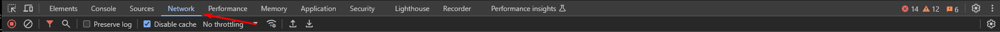
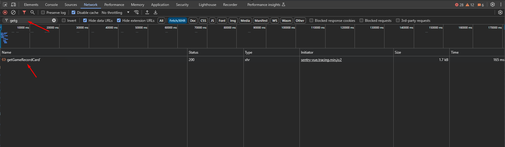
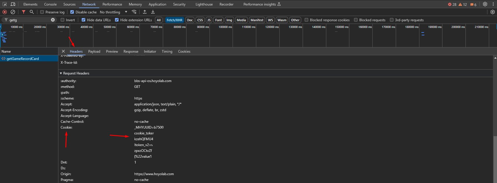

# How to get your HoYoLAB cookie string

`/link add` needs the cookie string from a logged-in HoYoLAB session. This guide
walks through extracting it from your browser's developer tools.

> [!IMPORTANT]
> Do everything below in a **single incognito / private window**. HoYoLAB and the
> code-redemption page share the same login, so the redeem attempt and the cookie
> extraction must happen in the **same session** — don't open a second window or
> log in again. A fresh incognito session also avoids grabbing cookies from a
> different account or a stale login.

## Extract the cookie (Network tab)

1. In your incognito window, open your
   [HoYoLAB profile](https://www.hoyolab.com/accountCenter/postList) and log in
   with your HoYoverse credentials.
2. In the **same window**, **attempt to redeem any promo code once** on a
   redemption page, e.g.:

    ```
    https://genshin.hoyoverse.com/en/gift?code=abc
    ```

    The code does **not** need to be valid — you just need to trigger one
    redemption attempt while logged in. Skip this and the cookie you extract will
    lack code-redemption capability, so `/link add`'s redeem feature won't work.
    Because it's the same login, this arms the very cookie you're about to copy.

3. Go back to the HoYoLAB tab and open developer tools with `F12`.
4. Switch to the **Network** tab.

    

5. Find the `getGameRecordCard` request (use the filter box to search for it). If
   nothing shows up, refresh the page with the dev tools still open.

    

6. Select that request, open **Headers**, and scroll to **Request Headers**. Copy
   the entire value of the `cookie` header — every `key=value` pair.

    

The value looks like this (yours will have more pairs):

```
mi18nLang=xxxx; _MHYUUID=xxxx; ltoken_v2=xxxx; ltuid_v2=xxxx; [additional pairs...]
```

> [!WARNING]
> Once you've copied the cookie, **do not log out** — just close the incognito
> tab/window. Logging out invalidates the session and the cookie you extracted
> will stop working.

## Link it to the bot

Paste the whole cookie string into the Discord slash command:

```
/link add cookie:<paste the full cookie string here>
```

One profile is created per cookie. From there, manage games and settings through
the other slash commands (`/link edit`, `/config`).

> [!NOTE]
> Tears of Themis has no game record card, so it can't be auto-detected on
> `/link add`. Enable it afterwards with `/link edit`.

## Credits

Adapted for this fork from
[torikushiii's cookie guide gist](https://gist.github.com/torikushiii/59eff33fc8ea89dbc0b2e7652db9d3fd)
and the promo-code prerequisite noted in its
[comments](https://gist.github.com/torikushiii/59eff33fc8ea89dbc0b2e7652db9d3fd?permalink_comment_id=5740319#gistcomment-5740319).
