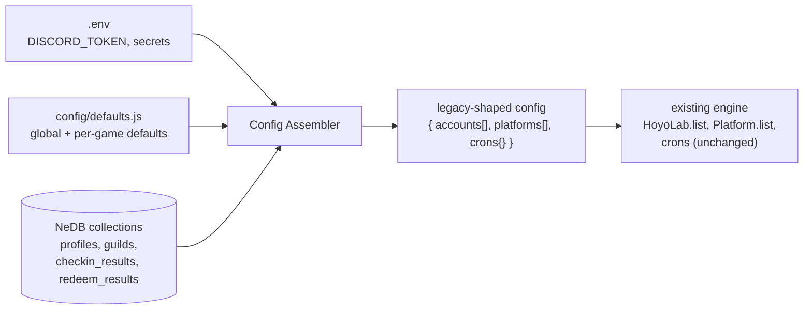
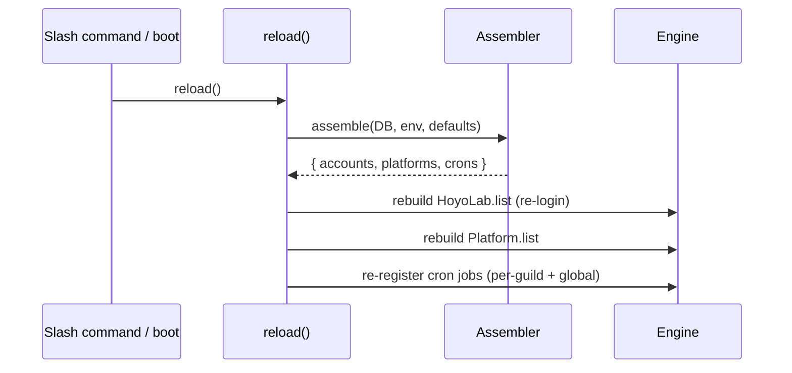
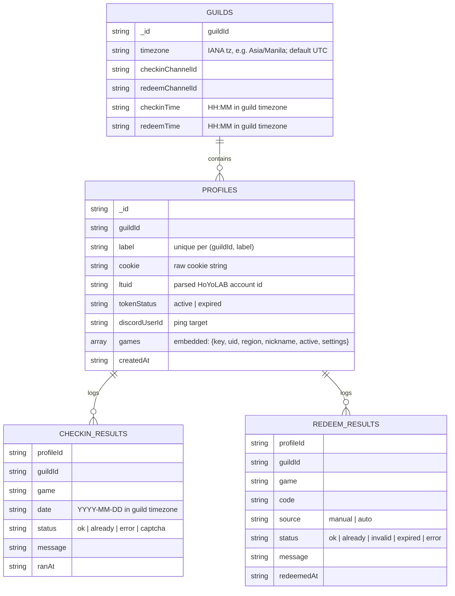

# DB-backed, command-managed config with per-profile multi-game support

**Status:** Draft for review
**Date:** 2026-07-07
**Scope:** Part A of two. Part B (CI + release skills) is a separate spec:
[`2026-07-07-release-engineering-design.md`](2026-07-07-release-engineering-design.md).

## Problem

hoyolab-auto is configured entirely through a static `config.json5` file. Its
account model is **game-grouped**: `accounts[]` contains one entry per game
type, and to use one HoYoLAB login across multiple games you copy the same
cookie string into each game entry by hand. There is no first-class "account"
(login) concept, no persistence beyond the file, no way to change anything
without editing the file and restarting, and no multi-guild isolation.

We want to run this as a **multi-guild Discord bot** where an admin links a
HoYoLAB login once (one cookie), the bot auto-detects every game that login
plays, and all configuration happens through Discord commands and interactive
forms — no config file.

## Goals

- Replace `config.json5` as the source of truth with an embedded document
  database (`@seald-io/nedb`). Defaults live in code.
- Model a **profile** (one HoYoLAB login = one cookie) that **has many games**,
  each with its own per-game settings — no cookie duplication.
- Manage everything through Discord slash commands + interactive components:
  link, list, edit (via buttons + modal form), remove, refresh, migrate,
  configure schedule/channel.
- **Multi-guild isolation:** a profile belongs to the guild it was added in and
  is only visible/actionable there.
- Log check-in and redeem **results** for history and code-dedup.
- Apply changes **live** — no process restart.
- Provide a one-time **`/migrate`** path from an existing `config.json5`.

## Non-goals

- Per-guild *cadence* for the polling reminder crons (stamina, expedition,
  realm, mimo, dailies, weeklies). Only the two daily jobs — **check-in** and
  **redeem** — are per-guild schedulable. Pollers keep a global cadence and
  route notifications per guild.
- Telegram/webhook feature parity work. The platform abstraction is preserved;
  Discord is the managed surface.
- Rewriting the game engine (crons, `HoyoLab`/`Platform` classes, game
  modules). They are reused unchanged behind an adapter.

## Guiding principles

- **KISS / DRY.** One `reload()` code path shared by boot and every mutation.
  A full rebuild on each admin action (data is tiny) instead of diffing.
- **Preserve the engine contract.** The engine consumes a `config`-shaped
  object (`accounts[]`, `platforms[]`, `crons{}`). We keep that contract and
  swap only its *source*, minimizing changes to proven code.

## Architecture

### The config-assembler seam

Today `index.js` does `const config = require("./config.js")` (parse
`config.json5`). We replace that single line's source with an **assembler**
that produces the same shape from the DB + `.env` + code defaults.



The assembler:

1. Reads all **active profiles** and transforms each profile's embedded
   `games[]` into hoyolab-auto's game-grouped `accounts[]` structure, merging
   stored per-game `settings` over `config/defaults.js`. Each runtime
   game-account carries its `guildId` so notification routing can find the
   right channel.
2. Builds `platforms[]` from `.env` secrets + per-guild channel routing.
3. Builds `crons{}` schedules from per-guild `guilds` docs (for check-in and
   redeem) and defaults (for pollers). Each guild's check-in/redeem job is
   registered as a per-guild `cron` job using that guild's `timezone` (the
   `cron` package's `timeZone` option), so an `HH:MM` fires at the guild's
   local time.

Downstream code (crons, game modules, `Platform.getForAccount`) is unchanged
except for guild-aware notification routing (below).

**Time display convention:** every time the bot *shows* a time (schedule
confirmations, notification footers, "next run"), it renders a Discord
timestamp (`<t:unix:style>`) so it auto-localizes to each viewer, rather than
printing a fixed-offset string.

### Live reload (DRY)

A single `reload()` function is the only bootstrap path:



`index.js` boot calls `reload()`. Every mutating command
(`/link add|remove|refresh`, `/link edit` submit, `/migrate`, `/config`) calls
`reload()` afterward. `/config schedule` may call only the reschedule step.
No duplicated bootstrap logic; no restart.

### Guild-aware notification routing

Runtime game-account objects gain `guildId`. The Discord platform resolves the
notification channel from the account's guild via the `guilds` collection
(`checkinChannelId` / `redeemChannelId`) instead of a single global channel.
Crons already iterate accounts; they now post each account's result to its
guild's channel.

## Data model (NeDB documents)

Games catalog stays **in code** (the `hoyolab-modules/<game>` definitions are a
fixed set); no collection needed. Game `key` ∈
`genshin | starrail | zenless | honkai | termis`.



### `profiles` — embedded games array

```json
{
  "_id": "auto",
  "guildId": "112233445566778899",
  "label": "lylevince",
  "cookie": "ltoken_v2=...; ltuid_v2=12345678; ...",
  "ltuid": "12345678",
  "tokenStatus": "active",
  "discordUserId": "1699...",
  "games": [
    {
      "key": "genshin",
      "uid": "800000001",
      "region": "os_asia",
      "nickname": "Traveler",
      "active": true,
      "settings": {
        "dailiesCheck": true,
        "weekliesCheck": true,
        "stamina": { "check": true, "threshold": 150, "persistent": false },
        "expedition": { "check": false, "persistent": false },
        "realm": { "check": false, "persistent": false },
        "redeemCode": true,
        "allowedPlatforms": null
      }
    },
    {
      "key": "starrail",
      "uid": "801000001",
      "region": "prod_official_asia",
      "nickname": "Trailblazer",
      "active": true,
      "settings": {
        "stamina": { "check": true, "threshold": 200 },
        "mimo": { "check": true, "redeem": false }
      }
    }
  ],
  "createdAt": "2026-07-07T00:00:00.000Z"
}
```

Stored `settings` is a partial override; the assembler deep-merges it over
`config/defaults.js[game]` so a document never has to be exhaustive.

### Status vocabularies (fixed)

- Check-in: `ok | already | error | captcha`. The engine's transient `auth`
  status (dead cookie) is stored as `error` and flips the profile's
  `tokenStatus` to `expired` (mirrors the reference bot).
- Redeem: `ok | already | invalid | expired | error`. Terminal = everything
  except `error`; `error` is retried.

## Data-access layer

A single thin repository module (`db/index.js`) is the only code that touches
NeDB, mirroring the reference bot's centralized `db.py`:

- `init()` — construct/`loadDatabase` the four datastores at a **fixed path**
  (`data/`, alongside the existing cache; relocatable only via the
  docker-compose volume — never an env var), ensure indexes
  (`profiles`: unique compound `guildId`+`label`; `guildId`; `ltuid`).
- Profiles: `upsertProfile`, `listProfiles(guildId)`, `getProfile(guildId,
  label)`, `removeProfile(guildId, label)`, `setTokenStatus(id, status)`,
  `updateGameSettings(id, gameKey, patch)`.
- Guilds: `getGuild(guildId)`, `setGuildChannel`, `setGuildSchedule`,
  `setGuildTimezone`.
- Results: `recordCheckin`, `recordRedeem`, `redeemedTerminal(profileId, game,
  code)` (dedup helper).

All methods async (`@seald-io/nedb` promise API). The "current day" for
check-in dedup is computed **in the guild's timezone** via a shared
`todayInGuildTz(tz)` helper (default `UTC`), so a guild's daily boundary is its
own local midnight.

## Commands

All under existing `commands/<name>/index.js` pattern. Admin-gated by **guild
permission** (nova-ph-bot style): `default_member_permissions: Administrator`
plus a runtime `interaction.memberPermissions.has(Administrator)` re-check
(server admins can override default perms, so both). Every command scopes to
`interaction.guildId`.

| Command | Behavior |
|---|---|
| `/link add cookie:<…> [label]` | Validate cookie against HoYoLAB; auto-detect **all** games with characters (resolve uid/region/nickname); upsert profile for this guild; `reload()`; reply summary. `label` defaults to the linker's Discord username. Re-adding an existing label **updates** it (idempotent). |
| `/link list` | This guild's profiles → games, `tokenStatus`. |
| `/link edit label:<…>` | Interactive editor (below). |
| `/link remove label:<…>` | Delete this guild's profile; `reload()`. |
| `/link refresh label:<…> cookie:<…>` | Replace cookie, reset `tokenStatus=active`, `reload()`. |
| `/migrate file:<config.json5>` | Parse an uploaded/attached config, upsert its accounts as profiles for this guild, report a summary. Absorbs `convert.js`'s job. |
| `/config schedule type:<checkin\|redeem> [time]` | Blank = show current (rendered as a Discord timestamp); set = write per-guild `HH:MM` interpreted in the guild's timezone (validated) + reschedule that guild's job. |
| `/config channel type:<checkin\|redeem> [channel]` | Blank = show current; set = write per-guild channel to `guilds`. |
| `/config timezone [tz]` | Blank = show current; set = validate an IANA tz (e.g. `Asia/Manila`) and store on the guild. Governs how `HH:MM` schedule times and the daily check-in boundary are interpreted. Default `UTC`. |

### Interactive game-config editor (`/link edit`)

Discord-native "form", no files. Requires a **component/modal interaction
router** added to `platforms/discord.js` (the one genuinely new subsystem —
today only ChatInput slash interactions are handled).

```mermaid
sequenceDiagram
    participant U as Admin
    participant B as Bot
    U->>B: /link edit label:main
    B-->>U: Game select menu (this profile's games)
    U->>B: selects "genshin"
    B-->>U: Settings panel: toggle buttons (on=green/off=grey) + "Edit values" button
    U->>B: clicks "Stamina" toggle
    B->>B: updateGameSettings(); reload()
    B-->>U: panel re-renders (Stamina on)
    U->>B: clicks "Edit values"
    B-->>U: Modal with numeric fields (e.g. stamina threshold)
    U->>B: submits modal
    B->>B: updateGameSettings(); reload()
    B-->>U: confirmation
```

- Toggles (booleans: dailies, weeklies, stamina check, expedition, realm,
  mimo, redeem, game `active`) → buttons that flip on click.
- Numbers (stamina threshold, etc.) → a modal (Discord's form) with text
  inputs, validated on submit.
- All writes go through `updateGameSettings` → `reload()`.

## Bootstrap & retirement

- `index.js`: replace `require("./config.js")` + the inline account/platform
  init loops with `await reload()`; keep the `globalThis.app` wiring.
- **Retire** `config.json5`, `config.js`, `default.config.json5`,
  `setup/config/index.html`, `convert.js`. Defaults move to
  `config/defaults.js`; `convert.js` logic moves into `/migrate`.
- `.env` (new): `DISCORD_TOKEN` (required), optional `TELEGRAM_TOKEN` /
  webhook URLs. **No DB path, no owner ids.**

## Error handling

- Invalid/expired cookie at `add`/`refresh`: reply with a clear error; do not
  persist a broken profile.
- Cookie without redeem capability (no `cookie_token_v2`): link succeeds,
  redeem is disabled for that profile with a note (engine already detects this).
- Missing guild channel when a cron wants to notify: log + skip that guild's
  notification (don't crash the run).
- `reload()` failures are caught and reported to the invoking interaction; the
  previously-running `HoyoLab.list` stays up if a rebuild throws.

## Testing

hoyolab-auto has no test framework today. Add **`node:test`** (built-in, zero
deps; escalate to `vitest` only if `node:test` proves limiting for async/mock
ergonomics). Test the three isolable, pure-ish units — never live HoYoLAB:

- **Cookie parsing / ltuid extraction** — pure function over strings.
- **Config assembler** — DB docs (+ defaults) → legacy `accounts[]`/`crons{}`
  shape, including deep-merge of partial settings and guild routing.
- **DB repository** — against a temp-file NeDB instance: upsert/list/remove
  scoping by guild, unique `(guildId,label)`, result recording + `redeemedTerminal`.

Engine/cron/Discord-transport code stays untested for now.

## Rollout

Additive, then flip:

1. Add `db/`, `config/defaults.js`, assembler, `reload()` — alongside the
   existing file path.
2. Add commands + the component/modal router.
3. Add guild-aware notification routing.
4. Flip `index.js` to `reload()`; delete the file-config remnants.
5. `/migrate` covers importing an existing `config.json5`.

## Open questions

None outstanding — all design decisions resolved in brainstorming.
