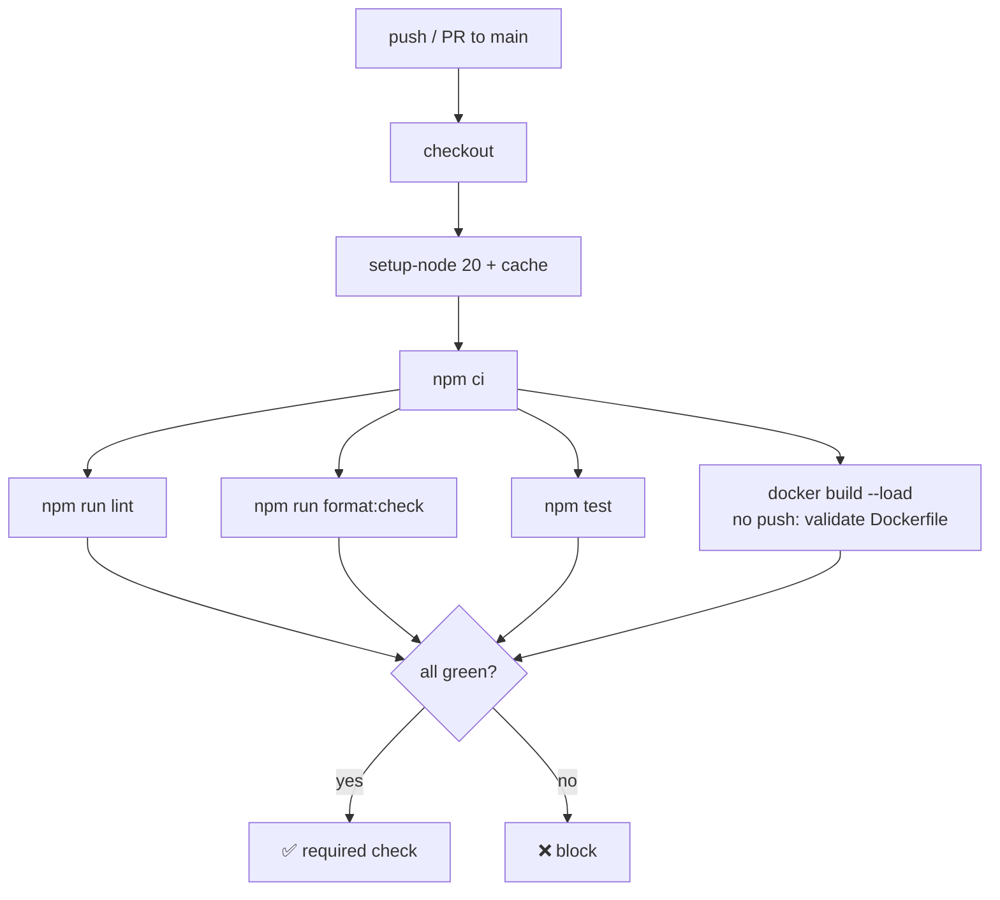
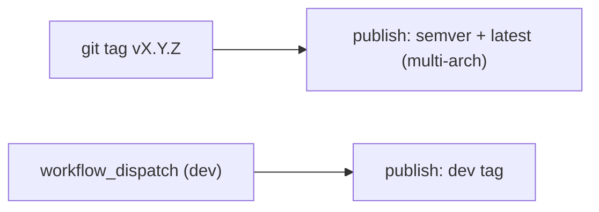
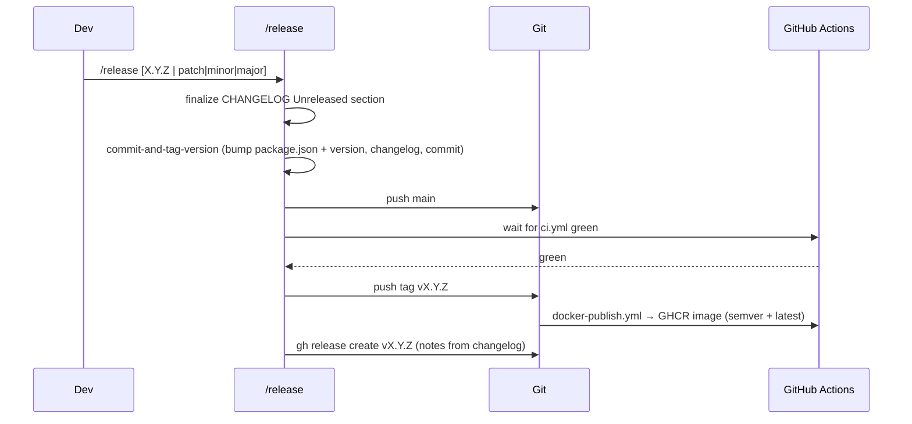
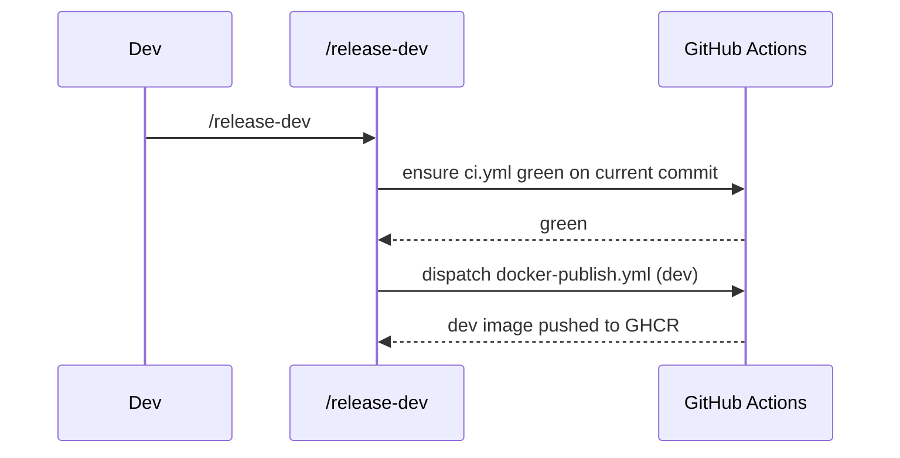

# Release engineering: tooling, CI, and release skills

**Status:** Draft for review
**Date:** 2026-07-07
**Scope:** Part B of two. Independent of and shippable separately from Part A
([`2026-07-07-db-command-config-design.md`](2026-07-07-db-command-config-design.md)).

## Problem

The fork has no local commit hygiene tooling, no CI, no changelog discipline,
and no repeatable release flow. Today `.github/workflows/docker-image.yaml`
builds and pushes a `latest` image on every push to `main` — no lint/test gate,
no versioned images, no release notes. We want the same disciplined workflow
the reference bot (`hoyolab-discord-bot`) has, adapted to this Node/CommonJS
project.

## Goals

- Enforce **Conventional Commits** and code quality locally via
  **commitizen** + **husky** git hooks, running **ESLint** + **Prettier**.
- **CI** (`ci.yml`): lint + test + Docker build-validate on every push/PR to
  `main`.
- **Versioned image publish**: on a `vX.Y.Z` tag, build & push to GHCR.
- Hand-maintained **`CHANGELOG.md`**, changelog/version bump automated from
  Conventional Commits via **`commit-and-tag-version`**.
- **`/release` skill**: finalize changelog → bump → push `main` → wait for CI
  green → push tag → GHCR image → GitHub release with notes.
- **`/release-dev` skill**: publish a **`dev`-tagged** image after CI is green.
  No bump, no changelog, no tag, no GitHub release.

## Non-goals

- npm package publishing (this is an app, not a library).
- Changing runtime behavior. This is purely repo/CI/release tooling.

## Local tooling

The project is CommonJS, Node ≥ 20, ESLint 8 already present
(`.eslintrc.json`), Prettier **not** present today.

### ESLint + Prettier

- Keep the existing ESLint config; add **Prettier** and
  **`eslint-config-prettier`** so ESLint and Prettier don't fight (Prettier owns
  formatting, ESLint owns correctness). Add a root `.prettierrc` and
  `.prettierignore`.
- Scripts (`package.json`):
  - `lint`: `eslint .` (exists)
  - `lint:fix`: `eslint . --fix` (exists)
  - `format`: `prettier --write .`
  - `format:check`: `prettier --check .`
  - `test`: `node --test` (from Part A; if absent, a `--passWithNoTests`-style
    no-op placeholder until Part A lands)

### Commitizen + husky

- **commitizen** with **`cz-conventional-changelog`** adapter → `npx cz` /
  `npm run commit` gives a guided Conventional-Commit prompt.
- **husky** git hooks:
  - `commit-msg`: **commitlint** (`@commitlint/cli` +
    `@commitlint/config-conventional`) rejects non-conforming messages — the
    enforcement backstop, so hand-typed commits are also validated.
  - `pre-commit`: **lint-staged** → run ESLint + Prettier on staged files only
    (fast; matches the global "format changed files" practice).
- `prepare` script: `husky` (installs hooks on `npm install`).

New dev dependencies: `prettier`, `eslint-config-prettier`, `husky`,
`lint-staged`, `commitizen`, `cz-conventional-changelog`, `@commitlint/cli`,
`@commitlint/config-conventional`, `commit-and-tag-version`.

## CHANGELOG

- Root **`CHANGELOG.md`**, Keep-a-Changelog style, an `Unreleased` section
  maintained as work lands (mirrors the reference bot).
- **`commit-and-tag-version`** (maintained fork of `standard-version`) reads
  Conventional Commits to move `Unreleased` → a versioned section, bump
  `package.json` **and** the existing root `version` file, and create the tag.
  Configured via `.versionrc` to keep the `version` file in sync
  (`bumpFiles`: `package.json` + `version`).

Three things stay in sync: `package.json` version = top `CHANGELOG.md` entry =
git tag = `version` file.

## CI (`.github/workflows/ci.yml`)

Trigger: `push` and `pull_request` to `main`.

Build-validate uses `docker/build-push-action` with `push: false` to confirm the
image builds (arch: `linux/amd64` for speed in CI).

## Image publish (`.github/workflows/docker-publish.yml`)

Replaces the current push-on-`main` behavior. Two triggers:

- **`push: tags: ['v*.*.*']`** → build multi-arch (`amd64`+`arm64`), push to
  `ghcr.io/<owner>/hoyolab-auto` tagged with the **semver** and `latest`.
- **`workflow_dispatch`** (used by `/release-dev`) with an input → build & push
  the **`dev`** tag only. Multi-arch optional (single-arch acceptable for dev
  speed).

The existing `docker-image.yaml` (push-on-main → `latest`) is **removed** so
`latest` only moves on a real tagged release.

Secrets reused from the current workflow: `GHCR_USERNAME`, `GHCR_TOKEN`.

## `/release` skill

A repo skill (`.claude/skills/release/SKILL.md`), mirroring the reference bot's
flow, Node-adapted:

Guardrails (from the reference skill): must be on `main`, clean tree, CI must be
green **before** the tag is pushed, version consistency check
(`package.json` = `version` file = changelog top = tag). The changelog/`bump:`
commits go straight to `main` (the one sanctioned exception to feature-branch
flow).

## `/release-dev` skill

A second repo skill (`.claude/skills/release-dev/SKILL.md`): a fast preview
publish with **no** version churn.

No changelog, no bump, no tag, no GitHub release. Purely a green-CI `dev` image.

## Rollout

1. Add Prettier + `eslint-config-prettier` + config files; add scripts.
2. Add husky + lint-staged + commitlint + commitizen; wire hooks.
3. Add `CHANGELOG.md` + `.versionrc` + `commit-and-tag-version`.
4. Add `ci.yml`; add `docker-publish.yml`; remove `docker-image.yaml`.
5. Author `/release` and `/release-dev` skills.

## Open questions

None outstanding.
