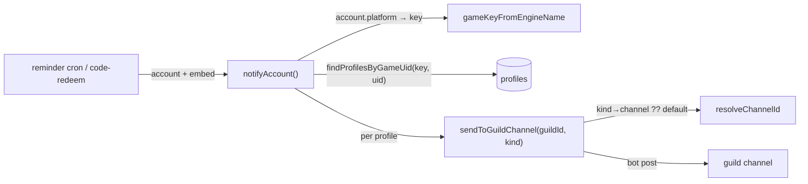

# Route reminder notifications through the Discord bot (DRY)

**Status:** Draft for review
**Date:** 2026-07-07
**Depends on:** the DB-backed command config
([`2026-07-07-db-command-config-design.md`](2026-07-07-db-command-config-design.md)),
which already routes **check-in** and **redeem** through the bot.

## Problem

In this Discord-bot-only fork, the assembler builds only the Discord platform —
no webhook, no telegram. But nine reminder crons still notify **exclusively via
webhook/telegram**:

`stamina`, `expedition`, `realm-currency`, `mimo`, `dailies-reminder`,
`weeklies-reminder`, `hilichurl`, `shop-status`, `howl-scratch-card`.

Each one ends with the identical block:

```js
const platforms = app.Platform.getForAccount(account);
for (const webhook of platforms.filter(p => p.name === "webhook")) {
	const userId = webhook.createUserMention(account.discord);
	await webhook.send(embed, { content: userId, ... });
}
for (const telegram of platforms.filter(p => p.name === "telegram")) {
	await telegram.send(escapedMessage);
}
```

Since no webhook/telegram platform is ever built, these reminders run but post
nowhere — invisible. Only check-in and redeem were wired to the bot.

## Goal

Route every reminder through the **Discord bot**, to a per-guild channel, via a
**single shared helper** — collapsing the duplicated webhook/telegram loops into
that one helper (kept for later, not scattered). Fold `code-redeem`'s own
near-identical routing into the same helper so there is exactly one place that
maps an account → its guild(s) → the delivery channels.

## Non-goals

- Changing what each reminder *decides* to send (thresholds, cadence, embed
  contents) — only *where/how* it's delivered.
- Per-reminder-type channels (one shared `reminder` channel covers them all).

## Webhook / telegram: kept, but centralized

Webhook and telegram are **retained** for future use, but the per-cron delivery
loops are the duplication we're eliminating. So all three channels — bot,
webhook, telegram — live **inside the one shared helper**, not scattered across
crons. Today the assembler builds only the Discord platform, so the
webhook/telegram branches are inert (empty `getForAccount` filter); when those
platforms are re-enabled they light up with zero cron changes. This satisfies
both goals: DRY (one delivery implementation) and future webhook/telegram
support.

## Design

### 1. Channel model: a `default` fallback

`/config channel` gains a **`default`** type plus **`reminder`**, so the choices
become `default | check-in | redeem | reminder`. Each writes
`${type}ChannelId` on the guild doc (the existing generic writer already does
this — only the command's `type` choices change).

Every notification resolves its channel as:

```
guild[`${kind}ChannelId`] ?? guild.defaultChannelId
```

So one `/config channel type:default #bot` makes check-in, redeem, and reminders
all post there; setting a specific type overrides it. This also gives check-in
and redeem a fallback they didn't have before.

Resolution is a pure function, `resolveChannelId(guild, kind)`, so it's unit
testable.

### 2. Engine-name → game-key mapping

Reminder crons carry `account.platform` as the **engine** name (`nap`, `tot`,
…), but profiles are keyed by DB game key (`zenless`, `termis`). Add a pure
`gameKeyFromEngineName(engineName)` to `config/games.js` (reverse of
`engineName`), unit tested against all five games.

### 3. The shared bot-notify helper (`core/notify.js`)

`sendToGuildChannel(guildId, kind, payload)` (already exists) changes only its
channel resolution to use `resolveChannelId` (kind → `${kind}ChannelId` →
`defaultChannelId`). Its never-throws / warn-and-skip contract is unchanged.

Add two helpers, both of which never throw. Each fans out to **all three
delivery channels** (bot always; webhook/telegram when those platforms exist):

- **`notifyAccount(account, { embeds, telegramText, ping = false, kind })`** —
  for per-account notifications (all reminders, plus redeem success/failed).
  1. **Bot:** maps `account.platform` → game key, calls
     `findProfilesByGameUid(gameKey, account.uid)`, and for each matching
     profile posts `sendToGuildChannel(profile.guildId, kind, { content, embeds
     })` where `content` is `<@profile.discordUserId>` when `ping` and the id
     exists, else `undefined`.
  2. **Webhook/telegram (retained, inert today):** `const platforms =
     Platform.getForAccount(account)`; for each `webhook` send each embed with
     `content: webhook.createUserMention(account.discord)`; for each `telegram`
     send `telegramText` (when provided).
- **`notifyGuildsForGame(gameKey, { embeds, telegramText, kind })`** — for
  game-level notifications with no account (redeem *manual* codes for
  honkai/tot). Bot: finds the unique, non-expired guilds that have that game
  active and posts once to each guild's channel (no ping). Webhook/telegram:
  broadcasts to every configured webhook/telegram platform (matching the
  original manual-code behavior).

Ping mentions ride in `content` (embeds never notify), matching the existing
check-in behavior. `telegramText` is the game-specific plain-text string each
cron already builds; passing it preserves telegram formatting for when that
platform returns.

### 4. Convert the nine reminder crons

Each cron keeps building its `embed` **and** its telegram text exactly as today,
then replaces its `getForAccount` + webhook-loop + telegram-loop with a single
call:

```js
const telegramText = app.Utils.escapeCharacters([ /* the cron's existing lines */ ].join("\n"));
await notifyAccount(account, { embeds: [embed], telegramText, ping: true, kind: "reminder" });
```

The `getForAccount` call and both delivery loops are removed from the cron (they
now live in the helper). `weeklies-reminder` and `hilichurl` build multiple
embeds / batch — they pass the array they already assemble.

### 5. Fold `code-redeem` into the helper

`crons/code-redeem/index.js`'s `recordAndNotify(data, message, status)` keeps
its DB `recordRedeem` call, but its inline `findProfilesByGameUid` loop and
webhook/telegram sends are replaced with:

```js
await notifyAccount(data.account, { embeds: [message.embed], telegramText: message.telegram, kind: "redeem" });
```

The `manual` loop (honkai/tot codes, no account) uses
`notifyGuildsForGame(gameKey, { embeds: [message.embed], telegramText: message.telegram, kind: "redeem" })`.
The webhook/telegram loops are removed from `code-redeem` — that delivery now
happens inside the helper.

### 6. Centralize the platform routing (don't scatter it)

After the conversion, `Platform.getForAccount`, `createUserMention`, and the
webhook/telegram send loops appear in exactly **one** place — inside
`notifyAccount` / `notifyGuildsForGame` — instead of in every cron. The
`Platform`/webhook/telegram classes are untouched (still the platform
abstraction). The crons no longer reference them directly.

## Data flow



## Error handling

- `notifyAccount` / `notifyGuildsForGame` never throw (wrapped); a failure to
  notify one guild logs a warning and continues to the next (same contract as
  `sendToGuildChannel`).
- A guild with neither the specific channel nor a `default` channel: the
  notification is skipped with a warn log (unchanged behavior).
- An account with no matching profile (e.g. its cookie expired and was excluded)
  simply notifies nobody — no error.

## Testing

Unit-test the pure units (consistent with Part A, where globals-based notify
code stays untested and is covered by the smoke path):

- `gameKeyFromEngineName` — all five engine names → keys, unknown → null.
- `resolveChannelId(guild, kind)` — returns the specific channel, falls back to
  `default`, returns null when neither is set.

`notifyAccount` / `notifyGuildsForGame` and the converted crons are verified via
the boot smoke (commands load, no reference errors) and manual in-Discord check,
not unit tests.

## Rollout

1. Add `gameKeyFromEngineName` + `resolveChannelId` (+ tests).
2. Add `notifyAccount` / `notifyGuildsForGame`; switch `sendToGuildChannel` to
   `resolveChannelId`.
3. Add `reminder` + `default` to `/config channel` choices; update COMMANDS.md.
4. Convert the nine reminder crons to `notifyAccount`.
5. Fold `code-redeem` (success/failed → `notifyAccount`, manual →
   `notifyGuildsForGame`); remove its webhook/telegram loops.

## Open questions

None outstanding.
